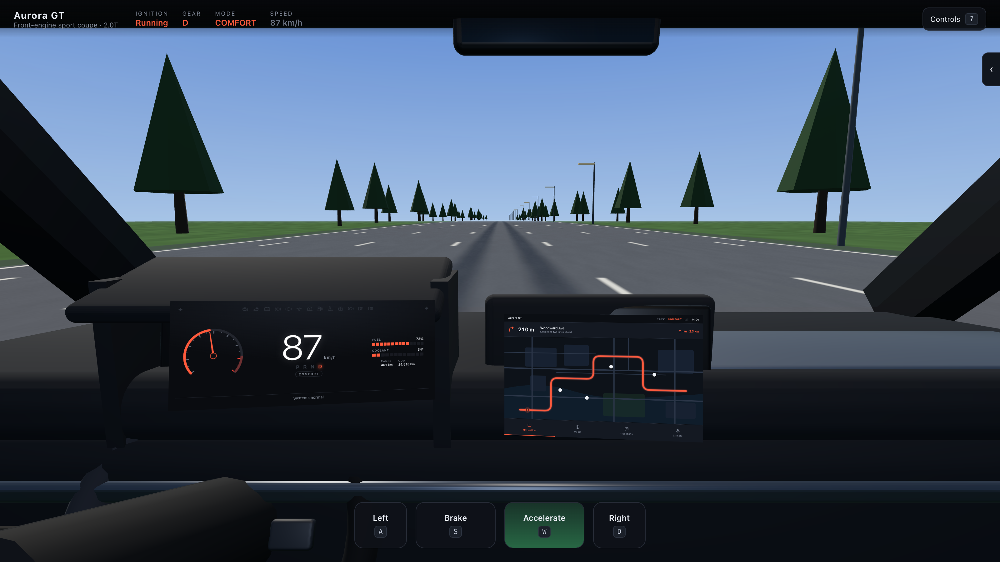
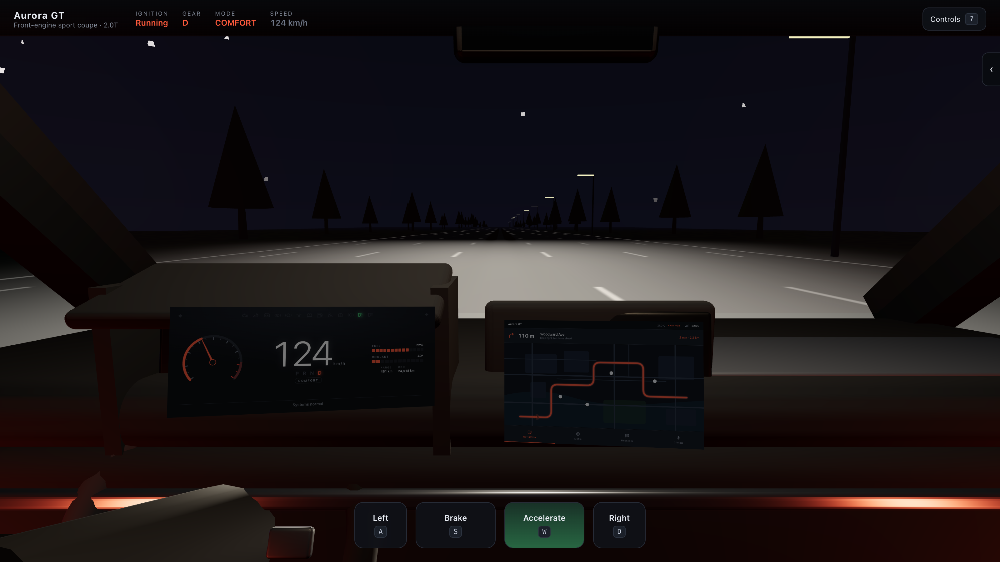
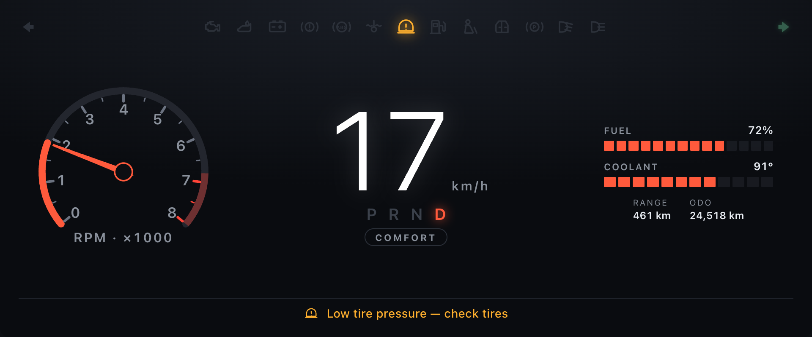
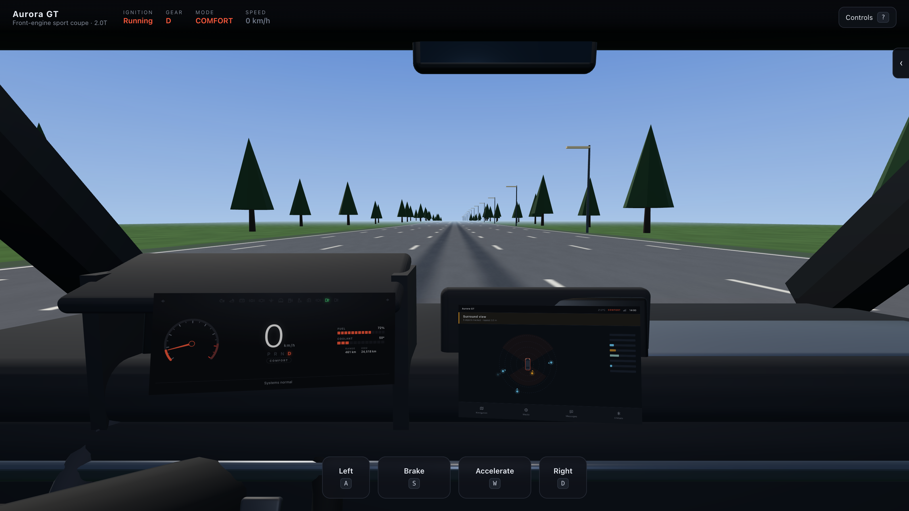
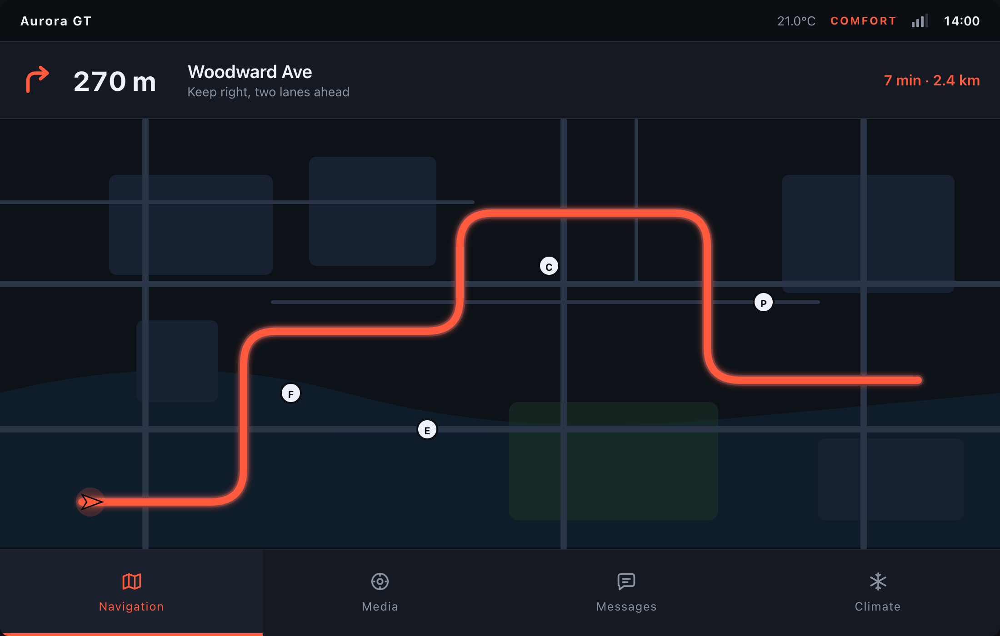
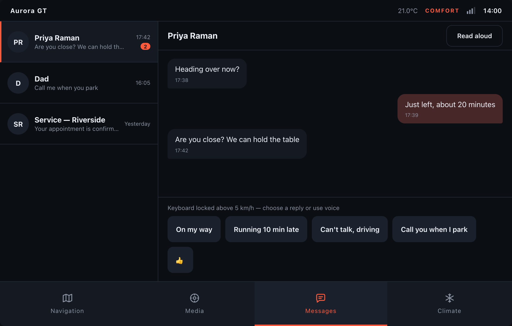
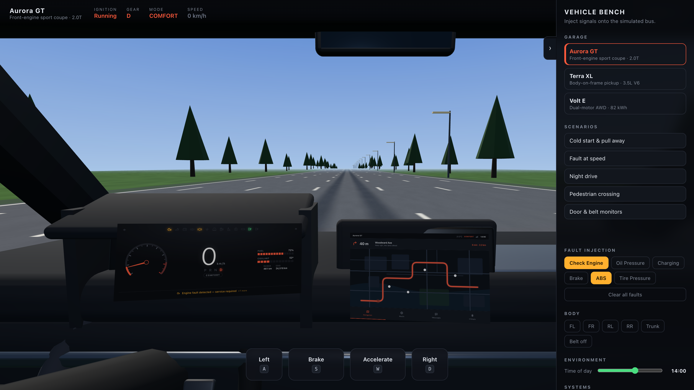

# Car Dashboard Simulator

An interactive 3D cockpit and infotainment simulator: a drivable instrument cluster, a
touchscreen head unit, lighting and telltale behaviour, and an ADAS surround view — all
driven by a single simulated vehicle bus.



**[Live demo](#) · [Controls](#controls) · [Architecture](#architecture)**

---

## What this is

A study in automotive HMI, built to be *explained* rather than just looked at. The
interesting parts are not the polygons — they are the decisions:

- **One source of truth for vehicle state.** Speed exists in exactly one place. The
  speedometer, the road scroll rate, the map's position along its route, the ADAS
  availability gate and the message-app keyboard lock are all derived from it. Nothing
  keeps a private copy.
- **Signals are published on a fixed cycle, not on every frame.** The physics integrates
  at 120 Hz internally and publishes at 50 Hz — the way a real ECU carries full precision
  internally and puts a rounded signal on the bus.
- **Telltales follow ISO 2575.** Red means stop, amber means service, green means active,
  blue means high beam. Symbols occupy fixed slots whether lit or not, because drivers
  notice "something appeared *there*" faster than they read any individual icon.
- **Safety behaviour is modelled, not decorated.** The transmission refuses P and R above
  walking pace. The messages app locks its keyboard above 5 km/h. Surround view stops
  producing tracks above 25 km/h, because short-range sensors have nothing useful to say
  at road speed. Dwelling on the touchscreen while moving dims it.

Everything is procedural — no model files, no textures, no HDRIs. The cabin is generated
from six numbers describing the vehicle package, and the road is a single plane with a
shader.

---

## The driving illusion

There is no world to drive through, and building one would have been the wrong problem.

The car never moves. A plane in front of the camera advances **one uniform** at a rate
proportional to `speed`, and roadside props recycle against the same number:

```
speed (km/h)  →  world.distance (m)  →  uDistance uniform  →  lane markings scroll
                                     →  instanced trees and poles recycle modulo run length
```

The road surface, lane markings, verge, aerial perspective and headlight beam are all
computed in one fragment shader. That buys three things a scrolling texture would not:
markings stay crisp at any distance, the night beam pattern is exactly controllable, and
"driving forward" reduces to incrementing a float.

Two details that took a second pass, both invisible in a still and obvious in motion:

- **Road curvature is quadratic in depth.** The road is straight under the car and sweeps
  at the horizon. Roadside props use *the same* bend function as the shader — when they
  didn't, trees drifted off the verge as soon as you steered.
- **Elevation is relative to the car.** Terrain height is sampled ahead *and* at the car's
  own position, and the difference is what gets displaced. Without that subtraction the
  profile lifts the road out from under a camera pinned at eye height, and the scenery
  floats.



---

## Architecture

Three layers, and a hard rule about which way data flows.

```
┌──────────────────────────────────────────────────────────────────┐
│  state/vehicleStore.ts        the bus — the only source of truth  │
│  speed · rpm · gear · lights · indicators · warnings · doors      │
│  Two writers exist: the sim loop, and driver-intent actions.      │
└────────────────────────────┬─────────────────────────────────────┘
                             │ everything below only ever reads
        ┌────────────────────┼────────────────────┬────────────────┐
        ▼                    ▼                    ▼                ▼
  scene/  (R3F)        cluster/  (SVG+DOM)   infotainment/    controls/
  cockpit, road,       gauges, telltales,    map, media,      pedals,
  lighting, hazards    message line          messages,        bench panel
                                             climate, ADAS
```

**`simulation/`** — `physics.ts` is pure functions (force curves, drag, gear selection);
`drivingLoop.ts` owns the timing and is the only thing in the app that calls `applyTick`.
`worldState.ts` holds the handful of values that change every frame and are consumed only
by the renderer — deliberately outside React, because pushing them through the store would
re-render the tree 60 times a second for a needle.

**`cars/`** — a car is *data*. `carRegistry.ts` lists three of them; each supplies a
powertrain profile, a colour theme, a cabin package and a cluster style. Adding a fourth
means adding a file. Loading one never touches vehicle state.

**Input arbitration** — the keyboard and the on-screen pedals both want to set `throttle`.
They publish *intent* to `input/pedalIntent.ts`, and exactly one arbiter turns intent into
a signal. (They originally each ran their own ramp, and fought: the keyboard raised the
pedal while the pointer loop dragged it back to zero.)

### Why the screens are DOM

The cluster and head unit are real HTML positioned in 3D by CSS3D, not UI painted into a
canvas texture. A texture would composite more correctly; DOM keeps every control
clickable, focusable and accessible, and the infotainment stack is the part a reviewer will
actually poke at. Each is a fixed-resolution panel — 960×400 and 1100×700 — mapped onto a
physical size in metres, so they behave like displays rather than like responsive web pages.



### 60 Hz values never re-render React

`cluster/useSignalAnimation.ts` runs a rAF loop, low-passes the signal and writes straight
to a DOM or SVG attribute. React renders the cluster's *structure* once and its discrete
state (gear, active telltales) as it changes. The damping is not just for looks — real
clusters damp their needles so the driver reads a stable value instead of a twitching one.

---

## Features

| | |
|---|---|
| **Powertrain** | Constant-power force curve, aero drag, rolling resistance, engine braking, six-speed auto with drive-mode-dependent shift points, fuel burn and coolant warm-up |
| **Drive modes** | Eco / Comfort / Sport change throttle shaping, available power and shift points — and the cluster's accent behaviour |
| **Lighting** | One continuous `timeOfDay` signal drives sky, sun arc, ambient, cabin light, street lamps, screen dimming and the headlight beam. There is no boolean "night mode" anywhere |
| **Headlights** | Low and high beam with distinct reach and spread, Gaussian falloff, and retroreflective lane markings that return more light than asphalt |
| **Telltales** | Ten ISO 2575 symbols with severity colouring, fixed slots, and a single message line showing the worst active fault |
| **Monitors** | Door-ajar, seatbelt, low fuel and overheat raise and clear themselves from signal state — no fault injection needed |
| **Navigation** | Live route progress driven by `world.distance`, a counting-down manoeuvre banner, and animated zoom into a POI or junction rather than a screen change |
| **Media / Messages / Climate** | Independent apps; Climate is the only one that writes vehicle state, Media touches none of it |
| **Surround view** | Plan view with distance rings and sensor wedges, threat-ranked track list, eight-sector proximity bars, escalating alert, and a speed-availability gate |
| **Garage** | Three cars — a combustion coupe, a tall pickup, and an EV whose cluster swaps a power meter for the tach and state-of-charge for fuel |






---

## Controls

Drag anywhere in the cabin to look around; double-click to recentre. Press <kbd>?</kbd>
in the app for this list.

| | | | |
|---|---|---|---|
| **Driving** | <kbd>W</kbd> / <kbd>S</kbd> accelerate, brake | <kbd>A</kbd> / <kbd>D</kbd> steer | <kbd>I</kbd> ignition |
| | <kbd>,</kbd> <kbd>.</kbd> shift P→R→N→D | <kbd>B</kbd> parking brake | <kbd>M</kbd> drive mode |
| **Lighting** | <kbd>L</kbd> headlights | <kbd>K</kbd> high beams | <kbd>T</kbd> day / dusk / night |
| | <kbd>Q</kbd> / <kbd>E</kbd> turn signals | <kbd>H</kbd> hazards | |
| **Systems** | <kbd>V</kbd> surround view | <kbd>?</kbd> controls | |

To get moving from cold: <kbd>I</kbd>, then <kbd>.</kbd> three times to reach D, then hold
<kbd>W</kbd>.

### The bench panel

The panel on the right is an engineering harness — the equivalent of a bench rig that
injects faults onto the bus so the HMI can be exercised without a vehicle producing them.
Everything it does goes through the same public store actions the rest of the app uses.

It also runs five scripted scenarios, each narrating itself step by step:

- **Cold start & pull away** — interlocks, telltale sweep, gear engagement
- **Fault at speed** — an amber fault, then a red one that outranks its message
- **Night drive** — dusk to dark, low then high beam, screens dimming with them
- **Pedestrian crossing** — slowing into the ADAS envelope, escalating to a red alert
- **Door & belt monitors** — telltales raised and cleared by monitors, not by injection



### Design harness

`#panels` renders the cluster and the head unit at 1:1 against a neutral ground. They are
normally viewed at an angle, at arm's length, through a windscreen — the right place to
judge glanceability and the wrong place to judge typography.

---

## Running it

```bash
npm install
npm run dev        # http://localhost:5173
npm run build      # production bundle in dist/
npm run preview    # serve the build on :4173
npm run typecheck
```

Screenshots in this README are generated, not hand-taken:

```bash
npm run build && npm run preview
npm run capture -- docs            # hero shots
npm run capture -- panels docs     # each panel at 1:1
npm run capture -- cars /tmp       # every car in the garage
```

`tools/capture.mjs` drives the app through real key and pointer events and fails on
any console error, so a successful capture doubles as a smoke test.

No API keys, no asset downloads, no network calls at runtime.

---

## On the choice of web tech

This is prototyped in React and Three.js for iteration speed, and that is worth being
explicit about: production automotive HMI is Java (Android Automotive) or C++ (QNX,
Qt/QML), with hard real-time constraints, safety certification and a genuine CAN bus rather
than a store with a fake cycle time.

What does carry over is the structure. A single owned state object that everything reads
and nothing duplicates, signals published on a fixed cycle, presentation strictly
downstream of vehicle state, telltale severity as a data property rather than a colour
someone typed into a stylesheet, apps that declare which signals they consume — those are
the same decisions in any stack. The rendering layer would be replaced wholesale. The
layering, and the reasons for it, would not.

---

## Roadmap

- [x] Cockpit, cluster, road-through-windshield, pedal and steering input
- [x] Lighting, telltales, day/night, fault injection, scripted scenarios
- [x] Infotainment: navigation with zoom-to-detail, media, messages, climate
- [x] Surround view with threat ranking and a speed-availability gate
- [x] Garage: three data-driven cars including an EV cluster variant
- [ ] Head-up display projected on the windshield
- [ ] Adaptive cruise with a lead vehicle and following-distance UI
- [ ] Recorded signal traces — replay a drive from a log instead of live input
