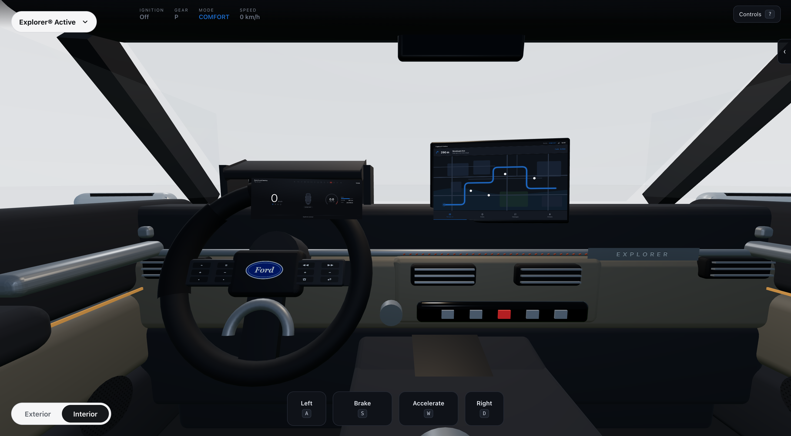
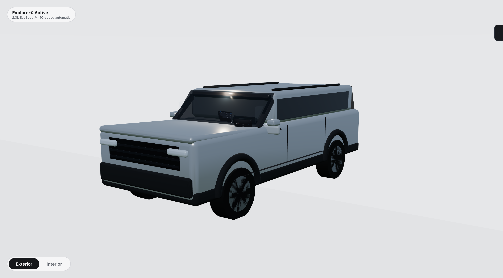
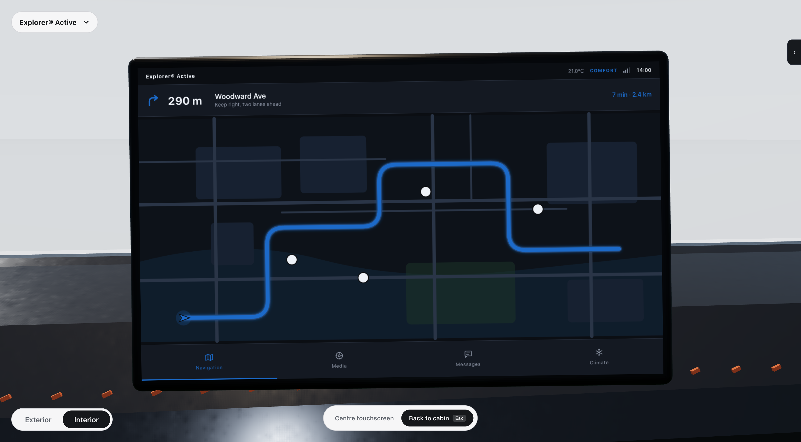
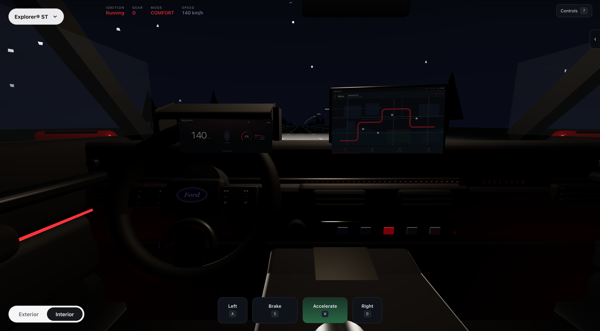

# Explorer Cockpit

An interactive recreation of a 2025 Ford Explorer interior that behaves like a
configurator until you start the engine, and then does everything a configurator
cannot: drive, light up, warn, navigate and watch the road for you.



**[Camera](#the-camera) · [Architecture](#architecture) · [Controls](#controls)**

*Not deployed yet: `npm run dev` to run it locally.*

> **Unaffiliated portfolio recreation.** This is a personal study of production
> HMI patterns, not a Ford product, and it is not affiliated with, endorsed by,
> or connected to Ford Motor Company. The vehicle likeness, "Explorer", "Ford"
> and the Ford oval are trademarks of Ford Motor Company. No Ford assets are
> distributed in this repository: every surface here is procedural geometry or a
> canvas texture generated at runtime.

---

## What this is

Two halves that share one world.

**As a configurator** it opens parked in a seamless grey studio. Drag to look
around the cabin from a fixed point between the front seats, scroll to tighten
the framing, switch trims, or flip to an exterior turntable.



**As a simulator** it has a full vehicle model underneath. Start the engine and
the studio dissolves into a road, the cluster comes alive, and the same camera
that was panning around a showroom starts refusing to let you look at the door
card at 60 km/h.

The interesting parts are the decisions, not the polygons:

- **One source of truth for vehicle state.** Speed exists in exactly one place.
  The speedometer, the road scroll rate, the map's position along its route, the
  ADAS availability gate, the messages keyboard lock and the camera's yaw clamp
  are all derived from it. Nothing keeps a private copy.
- **Signals publish on a fixed cycle, not every frame.** Physics integrates at
  120 Hz internally and publishes at 50 Hz, the way a real ECU carries full
  precision internally and puts a rounded value on the bus.
- **Telltales follow ISO 2575.** Red stop, amber service, green active, blue high
  beam. Symbols hold fixed slots whether lit or not, because a driver notices
  "something appeared *there*" faster than they read any individual icon.
- **Safety behaviour is modelled, not decorated.** The transmission refuses P and
  R above walking pace. The messages app locks its keyboard above 5 km/h.
  Surround view stops producing tracks above 25 km/h. Dwelling on the touchscreen
  while moving dims it. The camera's yaw range closes as the car gathers speed.

---

## The camera

The single most important thing to get right, and the part everything else is
framed by. It lives in [`src/scene/camera/`](src/scene/camera/), split into a
pure rig (`rig.ts`) and the input binding (`CameraRig.tsx`).

The interior view is **not** an orbit control and **not** a free-fly camera. It
is a fixed nodal point that rotates in place: dragging changes where you are
looking, never where you are, so parallax inside the cabin never shifts.

One shape covers both rigs. A pose is an **anchor**, a **radius**, a yaw, a pitch
and a field of view:

- `radius === 0` → **nodal**. The camera sits at the anchor. This is the interior.
- `radius > 0` → **orbit**. The camera sits on a sphere around the anchor and
  looks at it. This is the exterior turntable.

Because both are the same five numbers, moving between them is one interpolation
rather than two rigs and a hand-off — the camera flies out through the windscreen
and settles onto the turntable on its own.

| | |
|---|---|
| Yaw | ±75°, driver door card to passenger door card |
| Pitch | ±20°, clamped — enough for the console or the headliner, never enough to lose the dashboard |
| Zoom | 75° → 35° field of view. **Not** a dolly |
| Feel | Damped follow, release glide, soft stop at the clamps |
| Exterior | Azimuth only. No pitch, no zoom |

**Zoom is a field-of-view change, not a dolly.** Narrowing the FOV tightens the
framing while leaving every parallax relationship untouched. Dollying forward
would slide the dash past the door cards and immediately read as a game camera.

**The stop is soft because velocity dies at the wall.** The release glide moves
the *target*, which is hard-clamped; when it hits a limit the velocity is zeroed
and the damped follower eases in. No rubber band, no bounce.

**The yaw range closes with speed.** At rest you can look anywhere within ±75°.
By 60 km/h that has narrowed to ±22°, continuously, so the view *settles* forward
as the car accelerates rather than being yanked. Swinging your head to the door
card at motorway speed is exactly the eyes-off-road behaviour production HMI is
designed to discourage, and modelling the constraint is more honest than
allowing it.

Named poses — `interiorDefault`, `driving`, `infotainmentFocus`, `clusterFocus`,
`exteriorTurntable` — and a single `transitionTo(pose)` that animates between
any two.

---

## Focus: look, then act

Tap the centre screen and the camera comes to it, framing it square-on and
filling most of the viewport. The screen becomes fully interactive there. Escape,
the back affordance, or tapping away returns you to where you came from. Same
for the cluster.

Until a panel is focused it wears a transparent shield that intercepts the tap
and asks the camera to move. Without it the DOM swallows the first click and the
camera never goes anywhere — and a driver's glance never triggers an action,
which is the same progression this borrows from.



---

## The driving illusion

There is no world to drive through, and building one would have been the wrong
problem.

The car never moves. A plane in front of the camera advances **one uniform** at a
rate proportional to `speed`, and roadside props recycle against the same number:

```
speed (km/h) → world.distance (m) → uDistance → lane markings scroll
                                  → instanced trees and poles recycle
```

The road surface, markings, verge, aerial perspective and headlight beam are all
one fragment shader. That buys three things a scrolling texture would not:
markings stay crisp at any distance, the night beam pattern is exactly
controllable, and "driving forward" reduces to incrementing a float.

**The studio is the same world.** A second uniform, `uStudio`, dissolves the road
and sky into a seamless grey cyclorama. The configurator and the drive are one
scene at two settings, not two scenes swapped over.

Two details that took a second pass, invisible in a still and obvious in motion:

- **Curvature is quadratic in depth.** The road is straight under the car and
  sweeps at the horizon. Roadside props use *the same* bend function as the
  shader; when they didn't, trees drifted off the verge as soon as you steered.
- **Elevation is relative to the car.** Terrain height is sampled ahead *and* at
  the car's own position, and the difference is what gets displaced. Without that
  subtraction the profile lifts the road out from under a camera pinned at eye
  height, and the scenery floats.



---

---

## Architecture

Three layers and a hard rule about which way data flows.

```
┌────────────────────────────────────────────────────────────────────┐
│  state/vehicleStore.ts        the bus - the only source of truth   │
│  speed · rpm · gear · lights · indicators · warnings · doors       │
│  Two writers: the sim loop, and driver-intent actions. That is all.│
└──────────────────────────────┬─────────────────────────────────────┘
                               │ everything below only ever reads
   ┌──────────────┬────────────┼─────────────┬──────────────────┐
   ▼              ▼            ▼             ▼                  ▼
 scene/camera/  scene/       cluster/    infotainment/     configurator/
 nodal rig,     explorer/    gauges,     map, media,       trim pill,
 turntable,     cabin;       telltales,  messages,         view toggle,
 named poses    exterior/    vehicle     climate, ADAS     focus bar
                body         graphic
```

**`state/`** — `vehicleStore` is the bus. `viewStore` is deliberately separate:
where the camera is pointing is not a vehicle signal, and mixing them would make
the camera a writer. The rig reads vehicle state; nothing about the view ever
flows back.

**`simulation/`** — `physics.ts` is pure functions; `drivingLoop.ts` owns the
timing and is the only thing that calls `applyTick`. `worldState.ts` holds the
handful of values that change every frame and are consumed only by the renderer,
deliberately outside React.

**`cars/`** — a vehicle is *data*. Five Explorer trims share one cabin package
and override theme, powertrain and cluster skin. A genuinely different vehicle
would be another registry entry that brings its own package; nothing downstream
distinguishes the two, which is why the trim selector and a multi-car garage are
the same mechanism.

**Input arbitration** — keyboard and on-screen pedals both want to set `throttle`.
They publish *intent* to `input/pedalIntent.ts` and exactly one arbiter turns
intent into a signal. They originally each ran their own ramp, and fought.

### Why the screens are DOM

The cluster and head unit are real HTML positioned in 3D by CSS3D, not UI painted
into a texture. A texture would composite more correctly; DOM keeps every control
clickable, focusable and accessible, and the infotainment stack is the part a
reviewer actually pokes at. Each is a fixed-resolution panel — 1080×405 and
1400×840 — mapped onto a physical size in metres.

### 60 Hz values never re-render React

`cluster/useSignalAnimation.ts` runs a rAF loop, low-passes the signal and writes
straight to a DOM or SVG attribute. React renders structure once and discrete
state as it changes. The damping is not only cosmetic: real clusters damp their
needles so the driver reads a stable value rather than a twitching one.

---

## What is modelled, imported, or faked

**Modelled** — everything in the cabin. Dash, wheel, greenhouse, door cards,
console, seats, mirrors, and the exterior body. All procedural, generated from
the package numbers in `cars/explorer/cockpit.ts`.

**Imported** — nothing. No GLB, no textures, no HDRI, no fonts beyond the system
stack. There is no network request at runtime.

**Faked** — markings that never move, drawn to canvas at runtime: the speaker
grille perforations, the EXPLORER emboss, the mirror warning text, the shifter's
P-R-N-D-S ring, the wheel button glyphs and the door switch cluster. The
environment map is three coloured shapes baked to a cube map once per lighting
bucket, which is what gives the brightwork a highlight without shipping an HDRI.

Nothing is a photo backplate. There is no image-sequence pan anywhere.

### Surface texture

Every large surface carries a procedural bump map, and this is the single thing
that separates a render that reads as a photographed interior from one that
reads as CAD. A car interior is overwhelmingly matte, and a flat matte plane
under soft studio light contains no information at all — no amount of colour
correction fixes that, because the missing quantity is texture rather than hue.

- **Leather grain** on the padded panels, the wheel rim and the seat bolsters.
  Not so the grain is visible, but so the specular response varies across the
  panel and the eye has somewhere to land.
- **Woven textile** on the pale insert panels, which are cloth in the reference
  rather than painted plastic. The weave is deliberately close to sub-pixel: a
  weave you can resolve at arm's length reads as diamond plate, which is exactly
  what the first attempt looked like.
- **Perforation** on the seat centre panels, but not the bolsters.

The instrument panel is one extruded cross-section that rolls from cowl to crown
to shelf, rather than stacked boxes. Continuity of surface is most of what the
eye uses to tell a moulded interior from an assembly of parts, and boxes give
the right silhouette from one angle then fall apart the moment the camera moves
— which is precisely what this project lets a viewer do.

### Where it still falls short

Honest list, worst first:

- **Door cards, console and seats are still primitives.** The dash was lofted;
  they were not, and it shows where they meet. Closing the remaining gap is a
  modelling problem rather than a shading one.
- **No clearcoat on the brightwork and no anisotropy in the fabric**, so both
  hold up in silhouette and thin out under close inspection.
- **The exterior body** is proportional, not accurate — greenhouse taper,
  beltline kick and wheel design are approximations.
- **No camera feed** in surround view. The real system composites four fisheye
  cameras; this draws a synthetic plan view, which is the HMI half of the problem
  and not the computer-vision half.
- **Camera numbers are unverified** — see the note in `docs/visual-target.md`.

`docs/visual-target.md` records what the build is aiming at in full.

---

## Features

| | |
|---|---|
| **Configurator** | Nodal interior pan and zoom, exterior turntable, five trims, animated transitions between all of it |
| **Powertrain** | Constant-power force curve, aero drag, rolling resistance, engine braking, ten-speed auto with drive-mode shift points, fuel burn, coolant warm-up |
| **Lighting** | One continuous `timeOfDay` signal drives sky, sun arc, ambient, cabin light, street lamps, screen dimming and the headlight beam. No boolean night mode anywhere |
| **Headlights** | Low and high beam with distinct reach and spread, Gaussian falloff, retroreflective markings that return more light than asphalt |
| **Telltales** | Ten ISO 2575 symbols, severity colouring, fixed slots, one message line showing the worst active fault |
| **Monitors** | Door-ajar, seatbelt, low fuel and overheat raise and clear themselves from signal state, with no fault injected |
| **Navigation** | Live route progress from `world.distance`, a counting-down manoeuvre banner, animated zoom into a POI or junction rather than a screen change |
| **Surround view** | Plan view with distance rings and sensor wedges, threat-ranked track list, eight-sector proximity bars, escalating alert, speed-availability gate |

---

## Controls

Drag to look around; double-click to recentre; scroll to zoom. Press <kbd>?</kbd>
in the app for the full list.

| | | | |
|---|---|---|---|
| **Driving** | <kbd>W</kbd> / <kbd>S</kbd> accelerate, brake | <kbd>A</kbd> / <kbd>D</kbd> steer | <kbd>I</kbd> ignition |
| | <kbd>,</kbd> <kbd>.</kbd> shift P→R→N→D | <kbd>B</kbd> parking brake | <kbd>M</kbd> drive mode |
| **Lighting** | <kbd>L</kbd> headlights | <kbd>K</kbd> high beams | <kbd>T</kbd> day / dusk / night |
| | <kbd>Q</kbd> / <kbd>E</kbd> turn signals | <kbd>H</kbd> hazards | |
| **Systems** | <kbd>V</kbd> surround view | <kbd>Esc</kbd> leave a focused panel | <kbd>?</kbd> controls |

From cold: <kbd>I</kbd>, then <kbd>.</kbd> three times to reach D, then hold
<kbd>W</kbd>.

### The bench panel

The panel on the right is an engineering harness — the equivalent of a bench rig
that injects faults onto the bus so the HMI can be exercised without a vehicle
producing them. Everything it does goes through the same public store actions the
rest of the app uses. It also runs five scripted scenarios, each narrating itself
step by step.

### Design harness

`#panels` renders the cluster and the head unit at 1:1 against a neutral ground.
They are normally viewed at an angle, at arm's length, through a windscreen — the
right place to judge glanceability and the wrong place to judge typography.

---

## Running it

```bash
npm install
npm run dev        # http://localhost:5173
npm run build      # production bundle in dist/
npm run preview    # serve the build on :4173
npm run typecheck
```

Screenshots in this README are generated, not hand-taken:

```bash
npm run build && npm run preview
npm run capture -- docs            # hero shots
npm run capture -- panels docs     # each panel at 1:1
npm run capture -- cars /tmp       # every trim
```

`tools/capture.mjs` drives the app through real key and pointer events and fails
on any console error, so a successful capture doubles as a smoke test.

---

## On the choice of web tech

This is prototyped in React and Three.js for iteration speed, and that is worth
being explicit about: production automotive HMI is Java (Android Automotive) or
C++ (QNX, Qt/QML), with hard real-time constraints, safety certification and a
genuine vehicle bus rather than a store with a simulated cycle time.

What carries over is the structure. A single owned state object that everything
reads and nothing duplicates, signals published on a fixed cycle, presentation
strictly downstream of vehicle state, telltale severity as a data property rather
than a colour someone typed into a stylesheet, apps that declare which signals
they consume, and a camera that reads state and never writes it — those are the
same decisions in any stack. The rendering layer would be replaced wholesale. The
layering, and the reasons for it, would not.

---

## Roadmap

- [x] Nodal interior camera, exterior turntable, animated pose transitions
- [x] Explorer cabin and body, five data-driven trims
- [x] Configurator chrome: trim selector, view toggle, focus transitions
- [x] Cluster, infotainment, driving, lighting, warnings, surround view
- [ ] Cabin material pass: the greige fascia still reads a shade light against
      the reference, and the seats are barely in frame from the default pose
- [ ] Head-up display projected on the windscreen
- [ ] Adaptive cruise with a lead vehicle and following-distance UI
- [ ] Recorded signal traces: replay a drive from a log instead of live input
